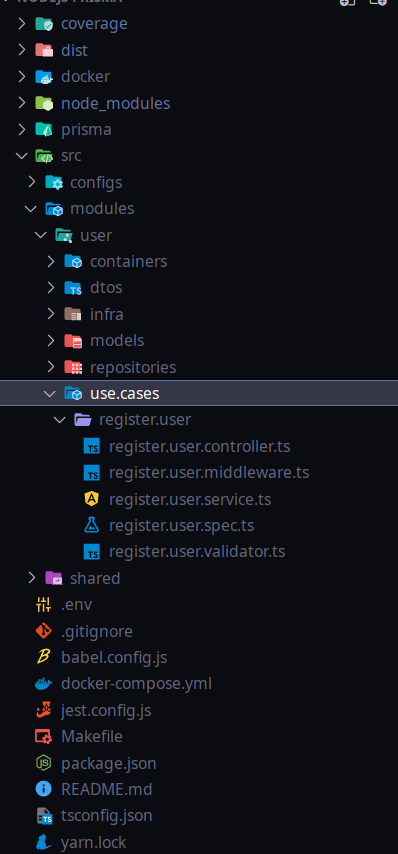
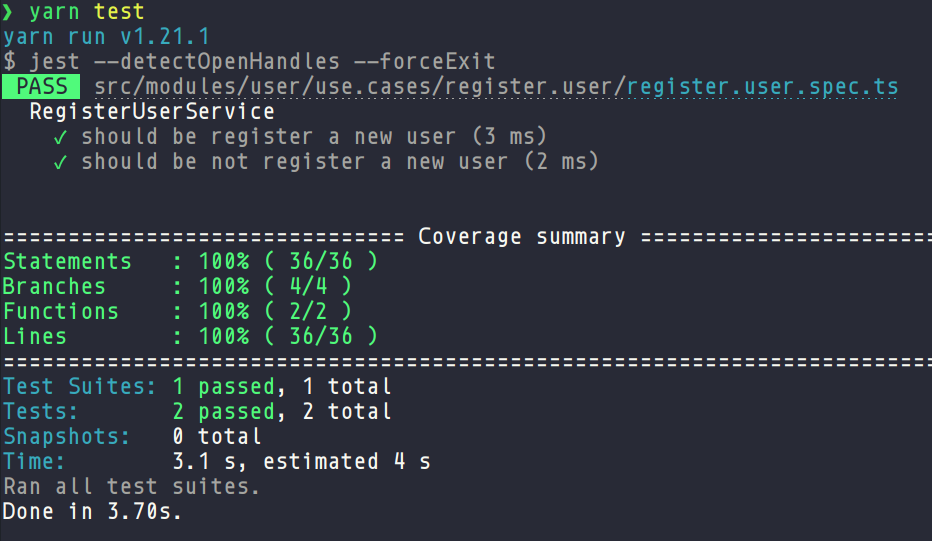
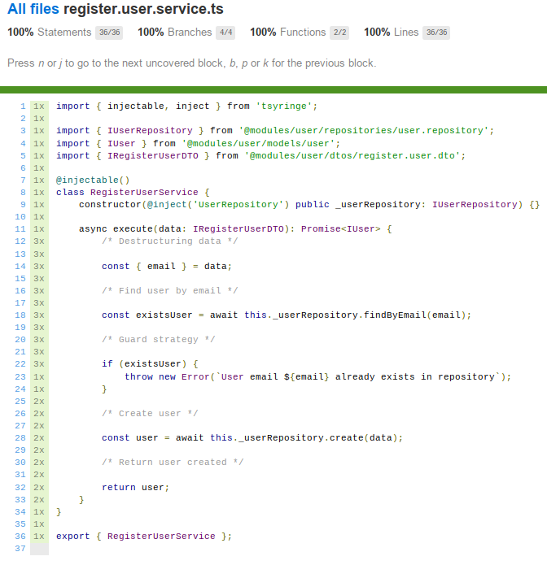

# NodeJs + Prisma

## Resumo

-   Arquitetura Feature By Package
-   Prisma
-   Teste unitário com coverage com o Jest
-   Injeção de dependência com o tsyringe
-   Docker

## Organização do projeto

-   Module
-   Service
-   Domain
-   Repository
-   Controller

## Padrões de projetos

-   Repository
-   Chain of responsability
-   Decorators
-   Dependency inversion

## Estrutura de pastas e arquivos



## Teste unitário com coverages





## Prisma package

```bash
yarn global add prisma
```

## Prisma init endpoint

```bash
prisma init
```

## Prisma generate

```bash
prisma generate
```

## Prisma db push

```bash
prisma db push
```
